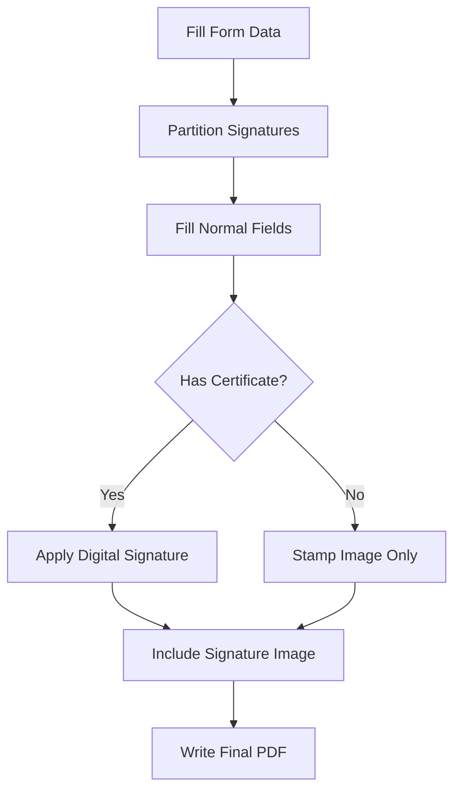

## Overview

The system supports two types of signatures for inspection forms:

1. **Handwritten Signatures**: Captured via signature pad and stamped on PDF forms
2. **Digital Certificates**: Cryptographic signatures using X.509 certificates for legal compliance

Both signature types are applied to PDF forms using HexaPDF, ensuring compatibility with Adobe Acrobat and other PDF readers.

## Signature Field Types

The system distinguishes between two signature field categories:

### Technician Signatures (Signature_Field)

Used for inspector/technician certification:

```json
{
  "name": "Inspector_Signature",
  "type": "Signature_Field",
  "section_name": "Certification",
  "label_name": "Inspector Signature",
  "is_signature": true
}
```

These fields are embedded in the main PDF form and can include digital certificates.

### Client Signatures (Signature_Annex)

Used for customer acknowledgment:

```json
{
  "name": "Customer_Signature",
  "type": "Signature_Annex",
  "section_name": "Customer Acknowledgment",
  "label_name": "Customer Signature",
  "is_signature": true
}
```

These signatures are rendered on dedicated annex pages with inspection report headers.

## Signature Detection

The `PdfSignatureService` automatically detects signature fields when parsing PDF templates:

```ruby
def self.list_signature_fields(file_path)
  doc = HexaPDF::Document.open(file_path)
  return [] unless doc.acro_form
  
  fields = []
  doc.acro_form.each_field do |field|
    next unless signature_field?(field)
    
    info = extract_signature_info(field)
    fields << {
      name: extract_field_name(field),
      is_signed: !info.nil?,
      info: info
    }
  end
  fields
end
```

### Signature Field Detection Logic

Fields are identified as signatures if:

```ruby
def self.signature_field?(field)
  (field.respond_to?(:field_type) && field.field_type == :Sig) ||
    field.type == :Sig
end
```

This detects PDF signature annotations with `/FT /Sig` field type.

## Handwritten Signatures

Technicians and customers can provide handwritten signatures using a signature pad interface.

<Steps>
  <Step title="Capture Signature">
    During form fill, click on a signature field to open the signature pad
  </Step>
  
  <Step title="Draw Signature">
    Use mouse, trackpad, or touchscreen to draw signature
  </Step>
  
  <Step title="Save as PNG">
    Signature is saved as a PNG image with transparent background
  </Step>
  
  <Step title="Attach to Form Fill">
    Image is attached via Active Storage with unique identifier:
    ```ruby
    def generate_unique_signature_attachment_id(field_name, field_section, field_type)
      signature_type = case field_type&.to_s
        when "Signature_Field" then "technician"
        when "Signature_Annex" then "client"
        else "technician"
      end
      
      "inspection_#{inspection.id}_signature_#{signature_type}_#{SecureRandom.hex(4)}.png"
    end
    ```
  </Step>
</Steps>

### Signature Image Storage

Signatures are stored with specific naming conventions to distinguish types:

- Technician: `inspection_123_signature_technician_a3f2.png`
- Client: `inspection_123_signature_client_b8c1.png`

This ensures the correct signature is applied to each field type.

## Stamping Signature Images

Handwritten signatures are stamped onto PDF signature fields using the `stamp_signature_image` method:

```ruby
def self.stamp_signature_image(file_path, output_path, field_name, image_path, 
                                scale_to_fit: true, margin: 0, allow_upscale: false)
  doc = HexaPDF::Document.open(file_path)
  field = doc.acro_form.field_by_name(field_name)
  
  # Get signature field widget (visible area)
  widget = field.each_widget.first
  rect = widget[:Rect]
  
  # Calculate image placement
  llx, lly, urx, ury = rect.value
  width = (urx - llx).abs
  height = (ury - lly).abs
  inner_width = [width - 2 * margin, 0].max
  inner_height = [height - 2 * margin, 0].max
  
  # Load and scale signature image
  image = doc.images.add(image_path)
  scale = [inner_width / image.width.to_f, inner_height / image.height.to_f].min
  scale = [scale, 1.0].min unless allow_upscale
  
  draw_w = image.width * scale
  draw_h = image.height * scale
  
  # Center image in signature field
  x = llx + margin + (inner_width - draw_w) / 2.0
  y = lly + margin + (inner_height - draw_h) / 2.0
  
  # Draw on overlay canvas
  page = find_page_for_widget(doc, widget)
  canvas = page.canvas(type: :overlay)
  canvas.image(image, at: [x, y], width: draw_w, height: draw_h)
  
  doc.write(output_path, optimize: true)
end
```

<Note>
Signature images are scaled to fit within the field boundaries while maintaining aspect ratio. By default, images are not upscaled to prevent pixelation.
</Note>

## Digital Certificates

For legally binding signatures, the system supports digital signing with X.509 certificates.

### Supported Certificate Formats

| Format | Extension | Description |
|--------|-----------|-------------|
| **PKCS#12** | `.p12`, `.pfx` | Combined certificate and private key with password protection |
| **PEM** | `.pem`, `.crt` | Separate certificate and key files |

### Applying Digital Signatures

Digital signatures are applied during PDF generation:

```ruby
def self.sign(file_path, output_path, field_name, 
              certificate_path:, certificate_password: nil, key_path: nil,
              reason: nil, location: nil, contact_info: nil, name: nil,
              signature_image_path: nil)
  
  doc = HexaPDF::Document.open(file_path)
  signer = build_signer(certificate_path, certificate_password, key_path)
  
  appearance = if signature_image_path && File.exist?(signature_image_path)
    {
      type: :image,
      image: signature_image_path
    }
  else
    {
      type: :text,
      text: build_appearance_text(name: name, reason: reason, location: location)
    }
  end
  
  doc.sign(
    output_path,
    signer: signer,
    signature_field: field_name,
    reason: reason,
    location: location,
    contact_info: contact_info,
    name: name,
    sub_filter: 'adbe.pkcs7.detached', # PAdES-compatible
    appearance: appearance
  )
end
```

### PAdES Compliance

The system uses the `adbe.pkcs7.detached` subfilter, which is compatible with:

- PDF Advanced Electronic Signatures (PAdES)
- Adobe Acrobat signature validation
- European eIDAS regulations
- Long-term signature validation (LTV)

<Accordion title="What is PAdES?">
PDF Advanced Electronic Signatures (PAdES) is a set of restrictions and extensions to PDF signatures that ensures:

- **Authenticity**: Verifies the signer's identity
- **Integrity**: Detects any modifications after signing
- **Non-repudiation**: Signer cannot deny having signed
- **Long-term validation**: Signatures remain valid even after certificate expiry

The system implements PAdES-B-B (baseline) level, suitable for most legal and compliance requirements.
</Accordion>

### Certificate Configuration

To use digital signatures, configure certificate details in the signing request:

<CodeGroup>
```ruby P12 Certificate
PdfSignatureService.sign(
  input_pdf,
  output_pdf,
  'technician_signature',
  certificate_path: '/path/to/cert.p12',
  certificate_password: 'secret123',
  reason: 'Fire Safety Inspection Certification',
  location: 'San Francisco, CA',
  contact_info: 'inspector@firemex.com',
  name: 'John Doe',
  signature_image_path: '/path/to/handwritten_sig.png'
)
```

```ruby PEM Certificate
PdfSignatureService.sign(
  input_pdf,
  output_pdf,
  'technician_signature',
  certificate_path: '/path/to/cert.pem',
  key_path: '/path/to/key.pem',
  reason: 'Fire Safety Inspection Certification',
  location: 'San Francisco, CA',
  name: 'John Doe'
)
```
</CodeGroup>

## Signature Metadata

When a PDF is digitally signed, the following metadata is embedded:

```ruby
SignatureInfo = Struct.new(
  :name,              # Signer name
  :signing_time,      # When the signature was applied
  :reason,            # Reason for signing
  :location,          # Geographic location
  :contact_info,      # Email or phone
  :sub_filter,        # Signature encoding format
  keyword_init: true
)
```

This metadata can be extracted from signed PDFs:

```ruby
def self.signature_info(file_path, field_name)
  doc = HexaPDF::Document.open(file_path)
  field = doc.acro_form.field_by_name(field_name)
  
  v = field.dict[:V]
  return nil unless v.is_a?(HexaPDF::Dictionary)
  
  SignatureInfo.new(
    name: v[:Name],
    signing_time: v[:M],
    reason: v[:Reason],
    location: v[:Location],
    contact_info: v[:ContactInfo],
    sub_filter: v[:SubFilter]
  )
end
```

## Signature Workflow

The complete signature workflow during PDF generation:



### Implementation in PdfFormsParserService

```ruby
def fill_form(output_path, field_data)
  normal_fields, signature_requests = partition_signature_requests(field_data)
  
  # Fill normal fields first
  @pdftk.fill_form(@file_path, output_path, prepare_field_values(normal_fields))
  
  intermediate_path = output_path
  
  # Apply signatures one by one
  signature_requests.each do |sig|
    tmp_out = Tempfile.create(['signed_', '.pdf'])
    field_name = sig['original_name'].presence || sig['name']
    
    if sig['certificate_path'].present?
      # Digital signature with certificate
      PdfSignatureService.sign(
        intermediate_path,
        tmp_out.path,
        field_name,
        certificate_path: sig['certificate_path'],
        certificate_password: sig['certificate_password'],
        signature_image_path: sig['signature_image_path']
      )
    else
      # Handwritten signature only
      PdfSignatureService.stamp_signature_image(
        intermediate_path,
        tmp_out.path,
        field_name,
        sig['signature_image_path']
      )
    end
    
    intermediate_path = tmp_out.path
  end
  
  FileUtils.cp(intermediate_path, output_path)
end
```

## Client Signature Annex Pages

Customer signatures are rendered on dedicated annex pages with inspection report headers:

```ruby
def self.add_signature_annexes(pdf_object, signature_images, inspection)
  contractor = ContractorInfo.first
  license = LicenseInfo.first
  
  annex_pdf_data = Prawn::Document.new(page_size: "LETTER") do |pdf|
    signature_images.each do |image|
      # Header section with inspection details
      pdf.text "Report of Inspection / Test", size: 16, style: :bold
      pdf.text "Date: #{inspection.date}"
      pdf.text "Property: #{inspection.property.address}"
      pdf.text "Conducted by: #{contractor.name}"
      
      # Signature section
      pdf.text "Customer's Signature", style: :bold
      
      # Signature table with customer name, signature image, and date
      # ... signature rendering code ...
    end
  end.render
  
  pdf_object << CombinePDF.parse(annex_pdf_data)
end
```

<Note>
Client signature pages include the company logo, contractor information, license number, and inspection metadata for a professional appearance.
</Note>

## Signature Validation

To verify a signed PDF's authenticity:

<Steps>
  <Step title="Open in Adobe Acrobat">
    Adobe Acrobat Reader shows a blue ribbon for valid signatures
  </Step>
  
  <Step title="Check Signature Panel">
    View signature details including:
    - Signer name and certificate
    - Signing time
    - Document integrity status
    - Certificate trust chain
  </Step>
  
  <Step title="Verify Certificate">
    Ensure the certificate is issued by a trusted Certificate Authority (CA)
  </Step>
</Steps>

<Warning>
Self-signed certificates will show as "validity unknown" in Adobe Acrobat. For legal compliance, use certificates from trusted CAs like DigiCert, GlobalSign, or government-issued certificates.
</Warning>

## Best Practices

<CardGroup cols={2}>
  <Card title="Separate Signature Types" icon="users">
    Use Signature_Field for technician signatures and Signature_Annex for customer acknowledgments to maintain clear separation
  </Card>
  
  <Card title="Use High-Quality Images" icon="image">
    Save signature pad captures as PNG with transparent backgrounds at 300 DPI for professional appearance
  </Card>
  
  <Card title="Secure Certificate Storage" icon="lock">
    Store P12/PFX files in encrypted storage with restricted access. Never commit certificates to version control.
  </Card>
  
  <Card title="Include Metadata" icon="info-circle">
    Always provide reason, location, and contact info when digitally signing for audit trail completeness
  </Card>
</CardGroup>

## Related Features

<CardGroup cols={2}>
  <Card title="Form Management" icon="file-invoice" href="/features/form-management">
    Configure signature fields in form templates
  </Card>
  
  <Card title="Inspections" icon="clipboard-check" href="/features/inspections">
    Complete inspections and capture signatures on-site
  </Card>
  
  <Card title="PDF Parsing" icon="file-pdf" href="/features/pdf-parsing">
    How signature fields are detected from PDF templates
  </Card>
  
  <Card title="Photo Management" icon="images" href="/features/photo-management">
    Manage visual documentation alongside signatures
  </Card>
</CardGroup>