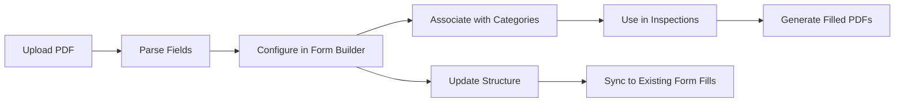

## Overview

Form Templates are the foundation of the inspection system. Each template represents a reusable PDF form that can be filled out during inspections. The system supports automatic field detection from PDF documents and manual customization through the Form Builder interface.

## Creating Form Templates

<Steps>
  <Step title="Navigate to Form Templates">
    From the main menu, click **Form Templates** → **New Form Template**
  </Step>
  
  <Step title="Upload PDF Document">
    Provide a name and upload a PDF file containing AcroForm fields. The system will automatically detect all interactive fields.
    
    <Note>
    The PDF must contain AcroForm fields. Scanned PDFs or flat PDFs without interactive fields will not work.
    </Note>
  </Step>
  
  <Step title="Configure Categories">
    Associate the template with:
    - **System Category**: Fire Alarm, Sprinkler, Kitchen Hood, etc.
    - **Interval Categories**: Monthly, Quarterly, Annual, 5-Year, etc.
    
    This allows the system to automatically select the correct form when creating inspections.
  </Step>
  
  <Step title="Wait for Processing">
    Large PDFs are processed in the background. The form structure will appear once processing completes (usually within seconds).
  </Step>
</Steps>

## Form Builder Interface

After a template is created, use the **Form Builder** to customize how fields appear during inspections.

### Accessing the Form Builder

From any Form Template page, click **Edit Form Builder** to open the visual editor.

### Field Configuration

Each field can be customized with the following properties:

<Accordion title="Basic Properties">
- **Label Name**: Human-readable label shown to technicians
- **Section Name**: Group related fields together (e.g., "Building Information | Address")
- **Page Number**: Organize fields by PDF page
- **Required**: Mark fields as mandatory for submission
</Accordion>

<Accordion title="Display Properties">
- **Column Width**: Control field width in the inspection interface (1-12 columns)
- **Field Order**: Drag and drop to rearrange field display order
- **Field Type**: Text, Checkbox, Photo, Signature, Deficiency, etc.
</Accordion>

<Accordion title="Section Organization">
Use the pipe character `|` in Section Name to create hierarchical groupings:

```
Building Information | Address
Building Information | Contact
Fire Alarm System | Panel Location
Fire Alarm System | Device Count
```

This creates collapsible sections in the inspection interface.
</Accordion>

## Field Types

The system supports multiple field types, each with specific behaviors:

### Standard Fields

| Type | Description | Use Case |
|------|-------------|----------|
| **Text** | Single-line text input | Names, addresses, serial numbers |
| **TextBox** | Multi-line text area | Notes, descriptions, comments |
| **Button** | Checkbox or radio button | Yes/No, Pass/Fail selections |
| **Choice** | Dropdown list | Predefined option selection |
| **Date** | Date picker | Inspection dates, expiration dates |

### Special Fields

<CodeGroup>
```json Photo Field
{
  "name": "equipment_photo",
  "type": "Photo",
  "section_name": "Equipment | Main Panel",
  "label_name": "Control Panel Photo",
  "required": true
}
```

```json Signature Field
{
  "name": "technician_signature",
  "type": "Signature_Field",
  "section_name": "Certification",
  "label_name": "Technician Signature",
  "is_signature": true
}
```

```json Deficiency Field
{
  "name": "deficiency_1",
  "type": "Deficiency",
  "section_name": "Deficiencies",
  "label_name": "Deficiency Item",
  "Item": "",
  "Riser": "",
  "C": "",
  "D": ""
}
```
</CodeGroup>

### Category Fields

Two special field types auto-populate from system configuration:

- **System Category**: Dropdown of configured fire safety systems
- **Interval Category**: Dropdown of inspection intervals

These fields are automatically filled when creating an inspection based on the selected categories.

## Form Structure Storage

Form templates store their field configuration as JSON in the `form_structure` column:

```ruby
class FormTemplate < ApplicationRecord
  has_many :inspections
  has_many :form_fills
  has_one_attached :original_file
  has_and_belongs_to_many :interval_categories
  
  validates :original_file, presence: true
end
```

### Updating Form Structure

When you save changes in the Form Builder, the entire field array is saved:

```ruby
def form_builder_update
  new_order = JSON.parse(form_template_params[:form_structure_order])
  
  if new_order.is_a?(Array)
    @form_template.update(form_structure: new_order.to_json)
    redirect_to form_builder_form_template_path(@form_template),
                notice: 'Form structure updated successfully.'
  end
end
```

<Warning>
Changing a form template's structure will **automatically update** all associated `FormFill` records that haven't been completed yet. Completed inspections retain their original structure.
</Warning>

## Template Categories

### System Categories

Assign templates to fire safety system types:

- Fire Alarm Systems
- Sprinkler Systems  
- Kitchen Hood Suppression
- Emergency Lighting
- Fire Extinguishers
- Standpipe Systems

### Interval Categories

Associate templates with inspection frequencies:

- Monthly
- Quarterly  
- Semi-Annual
- Annual
- 5-Year

<Note>
A single template can be associated with **multiple interval categories**. For example, a sprinkler form might be used for both annual and 5-year inspections.
</Note>

## Special Templates

The system uses specific template names for automatic workflows:

### Deficiencies Template

When creating an inspection, the system automatically creates a "Deficiencies" form fill if a template named **"Deficiencies"** exists:

```ruby
deficiencies_template = FormTemplate.find_by(name: "Deficiencies")
if deficiencies_template
  FormFill.create!(
    name: "#{property.property_name} - Deficiencies",
    form_template: deficiencies_template,
    inspection: @inspection
  )
end
```

### Additional Risers Template

For sprinkler systems with multiple risers, use a template named **"Additional Risers"**:

```ruby
additional_risers_template = FormTemplate.find_by(name: "Additional Risers")
```

### Corrected Deficiencies Template

Track deficiency corrections with a template named **"Corrected Deficiencies"**.

## Updating Templates

You can update existing templates in two ways:

### Update Metadata Only

Change the name, description, or associated categories without re-parsing the PDF:

1. Navigate to the template
2. Click **Edit**
3. Update fields
4. Click **Save**

### Replace PDF and Re-parse

Upload a new PDF to replace the template:

1. Click **Edit**
2. Upload new PDF file
3. System will re-parse all fields
4. Review and update field configuration in Form Builder

<Warning>
Replacing a template's PDF will reset all custom field configurations. Export your field configuration before replacing if you need to preserve customizations.
</Warning>

## Template Lifecycle



## Best Practices

<CardGroup cols={2}>
  <Card title="Consistent Naming" icon="tag">
    Use clear, descriptive names for templates that indicate both system type and interval (e.g., "Fire Alarm - Annual Inspection")
  </Card>
  
  <Card title="Section Organization" icon="layer-group">
    Group related fields using section names with pipe separators for better UX during inspections
  </Card>
  
  <Card title="Required Fields" icon="asterisk">
    Mark critical fields as required to ensure technicians complete all necessary information
  </Card>
  
  <Card title="Photo Fields" icon="camera">
    Add Photo fields for equipment that requires visual documentation during inspections
  </Card>
</CardGroup>

## Related Features

<CardGroup cols={2}>
  <Card title="PDF Parsing" icon="file-pdf" href="/features/pdf-parsing">
    Learn how PDF field detection works under the hood
  </Card>
  
  <Card title="Inspections" icon="clipboard-check" href="/features/inspections">
    Use templates to create and complete inspections
  </Card>
  
  <Card title="Photo Management" icon="images" href="/features/photo-management">
    Attach photos to inspection forms
  </Card>
  
  <Card title="Digital Signatures" icon="signature" href="/features/digital-signatures">
    Add technician and client signatures to forms
  </Card>
</CardGroup>