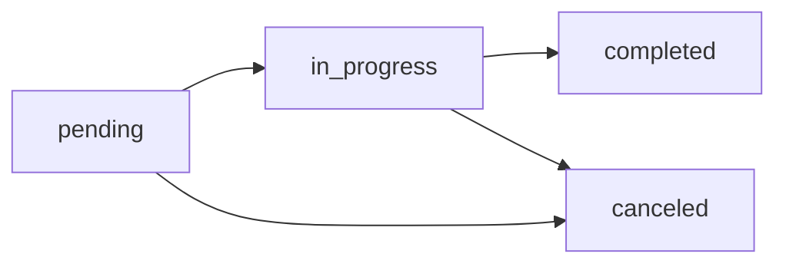

## Overview

Inspections are the core workflow of the system. Each inspection represents a scheduled fire safety assessment at a property, with associated form fills that technicians complete on-site.

## Creating an Inspection

<Steps>
  <Step title="Navigate to Inspections">
    From the main menu, click **Inspections** → **New Inspection**
  </Step>
  
  <Step title="Select Property and Customer">
    Choose the customer, then select the specific property being inspected.
    
    <Note>
    Properties are filtered by customer to make selection easier. You can also create a new property from this screen if needed.
    </Note>
  </Step>
  
  <Step title="Configure Inspection Details">
    - **Date**: When the inspection will occur
    - **System Category**: Type of fire safety system (Fire Alarm, Sprinkler, etc.)
    - **Interval Category**: Inspection frequency (Monthly, Annual, etc.)
    - **Technician**: Assign to a user with Technician role
    - **Job Number**: Optional reference number
  </Step>
  
  <Step title="Automatic Form Creation">
    The system automatically creates form fills based on your selections:
    - Main inspection form (matching system + interval categories)
    - Deficiencies form
    - Additional Risers form (if applicable)
    - Corrected Deficiencies form
  </Step>
</Steps>

## Inspection Model

Inspections are represented by the `Inspection` model located at `app/models/inspection.rb:1`:

```ruby
class Inspection < ApplicationRecord
  belongs_to :property
  belongs_to :form_template
  belongs_to :user
  has_many :form_fills, dependent: :destroy
  
  delegate :customer, to: :property
  
  validates :date, presence: true
  validates :property_id, presence: true
end
```

## Inspection Status Workflow

Inspections progress through several statuses:



### Status Descriptions

| Status | Description | Actions Available |
|--------|-------------|-------------------|
| **pending** | Scheduled but not started | Start, Cancel |
| **in_progress** | Technician is on-site | Complete, Cancel |
| **completed** | Finished and PDF generated | View, Email, Re-open |
| **canceled** | Inspection was canceled | Delete, Re-activate |

### Updating Status

Technicians can update inspection status from the inspection detail page:

```ruby
def update_status
  new_status = params[:status].presence || "completed"
  
  if @inspection.update(status: new_status)
    TransferDeficienciesJob.perform_later(@inspection.id) if new_status == "completed"
    redirect_to inspection_path(@inspection), 
      notice: "Inspection marked as #{new_status}."
  end
end
```

<Note>
When an inspection is marked as **completed**, the system automatically transfers deficiencies to the Deficiencies module for tracking and follow-up.
</Note>

## Form Fill Structure

Each inspection contains multiple form fills:

### Main Form Fill

The primary inspection form, matching the system and interval categories:

```ruby
main_form_template = get_form_template(inspection_params)
@inspection.form_template_id = main_form_template&.id

FormFill.create!(
  name: "#{property.property_name} - #{system_category} - #{interval_category}",
  form_template: main_form_template,
  inspection: @inspection,
  form_structure: main_form_template.form_structure
)
```

### Supplementary Forms

Automatically created if templates exist:

<CodeGroup>
```ruby Deficiencies Form
deficiencies_template = FormTemplate.find_by(name: "Deficiencies")
FormFill.create!(
  name: "#{property.property_name} - Deficiencies",
  form_template: deficiencies_template,
  inspection: @inspection
)
```

```ruby Additional Risers Form  
additional_risers_template = FormTemplate.find_by(name: "Additional Risers")
FormFill.create!(
  name: "#{property.property_name} - Additional Risers",
  form_template: additional_risers_template,
  inspection: @inspection
)
```

```ruby Corrected Deficiencies Form
corrections_template = FormTemplate.find_by(name: "Corrected Deficiencies")
FormFill.create!(
  name: "#{property.property_name} - Corrected Deficiencies",
  form_template: corrections_template,
  inspection: @inspection
)
```
</CodeGroup>

## Completing Inspections

Technicians complete inspections by filling out the associated forms:

<Steps>
  <Step title="Open Inspection">
    Navigate to the inspection from the calendar, dashboard, or inspections list
  </Step>
  
  <Step title="Fill Out Forms">
    Click on each form fill to enter data:
    - Text fields for equipment details
    - Checkboxes for Pass/Fail/N/A selections
    - Photo uploads for visual documentation
    - Signatures for certification
    - Deficiency tracking for failed items
  </Step>
  
  <Step title="Review Form Counts">
    The inspection detail page shows summary statistics:
    ```ruby
    @form_counts = @form_fill&.calculate_form_counts
    # Returns: { pass: 15, fail: 2, na: 3 }
    ```
  </Step>
  
  <Step title="Generate PDF">
    Click **Generate PDF** to create the final inspection report. This merges:
    - Main inspection form
    - Deficiencies (if any)
    - Additional risers (if applicable)
    - Photo annex pages
    - Signature pages
  </Step>
  
  <Step title="Mark Complete">
    Update status to **completed** to finalize the inspection and transfer deficiencies for tracking
  </Step>
</Steps>

## Auto-Fill Header Fields

The system automatically populates common header fields when an inspection is created:

```ruby
HeaderAutoFillerService.new(@inspection).call
```

This fills fields like:
- Inspection date
- Property address
- Customer name
- Technician name
- Job number

<Accordion title="How Auto-Fill Works">
The `HeaderAutoFillerService` scans form structure for common field names (case-insensitive):
- `date`, `inspection_date`, `Date_Completed`
- `property`, `property_address`, `location`
- `customer`, `customer_name`, `building_owner`
- `technician`, `inspector`, `performed_by`

It then populates these fields with data from the inspection, property, and customer records.
</Accordion>

## Inspection Calendar

View all inspections in a monthly calendar interface:

```ruby
def calendar
  @current_date = params[:date] ? Date.parse(params[:date]) : Date.current
  month_start = @current_date.beginning_of_month
  month_end = @current_date.end_of_month
  
  @month_inspections = policy_scope(Inspection)
    .where(date: month_start..month_end)
    .order(:date)
end
```

The calendar shows:
- Inspections grouped by day
- Color coding by status
- Technician assignments
- Quick links to inspection details

## Dashboard Metrics

The inspection dashboard provides real-time statistics:

```ruby
def dashboard
  @total_inspections = Inspection.count
  @pending_inspections = Inspection.where(status: "pending").count
  @completed_inspections = Inspection.where(status: "completed").count
  @this_month_inspections = Inspection.where(
    date: Date.current.beginning_of_month..Date.current.end_of_month
  ).count
  
  @upcoming_inspections = Inspection
    .where(date: Date.current..1.week.from_now)
    .where(status: %w[pending in_progress])
    .order(:date)
end
```

## Property Inspection History

View all inspections for a specific property:

```ruby
def by_property
  @property = Property.find(params[:property_id])
  @inspections = @property.inspections
    .order(date: :desc)
    .page(params[:page])
    .per(10)
  
  @total_inspections = @property.inspections.count
  @completed_inspections = @property.inspections.where(status: "completed").count
end
```

This shows:
- Historical inspection records
- Compliance trends
- Recurring deficiencies
- Upcoming scheduled inspections

## PDF Generation

When a technician clicks "Generate PDF," the system creates a comprehensive inspection report:

<Steps>
  <Step title="Queue Background Job">
    The form fill is marked as `generating` and `GeneratePdfJob` is enqueued
  </Step>
  
  <Step title="Fill PDF Form">
    The `PdfFormsParserService` fills the original PDF template with inspection data
  </Step>
  
  <Step title="Add Signatures">
    Digital signatures and handwritten signature images are applied to signature fields
  </Step>
  
  <Step title="Merge Supplementary Forms">
    Additional risers and deficiencies forms are appended if they have data
  </Step>
  
  <Step title="Append Photo Pages">
    Photos are organized by section and added as annex pages with captions
  </Step>
  
  <Step title="Save and Attach">
    The final PDF is attached to the form fill and marked as `completed`
  </Step>
</Steps>

<Note>
PDF generation happens asynchronously. Large inspections with many photos may take 30-60 seconds to process.
</Note>

## Filtering and Search

The inspections index supports multiple filters:

```ruby
@inspections = @inspections.where(status: params[:status]) if params[:status].present?

if params[:customer_id].present?
  @inspections = @inspections.joins(:property)
    .where(properties: { customer_id: params[:customer_id] })
end

if params[:from_date].present? && params[:to_date].present?
  @inspections = @inspections.where(
    date: Date.parse(params[:from_date])..Date.parse(params[:to_date])
  )
end
```

Available filters:
- **Status**: pending, in_progress, completed, canceled
- **Customer**: Filter by customer account
- **Date Range**: From/to date selection
- **Technician**: Filter by assigned technician

## Best Practices

<CardGroup cols={2}>
  <Card title="Schedule in Advance" icon="calendar-days">
    Create inspections 1-2 weeks ahead to ensure technician availability and customer coordination
  </Card>
  
  <Card title="Complete On-Site" icon="mobile">
    Fill forms during the inspection rather than afterward to ensure accuracy and reduce forgotten details
  </Card>
  
  <Card title="Photo Documentation" icon="camera">
    Take photos of all equipment, deficiencies, and corrections for comprehensive records
  </Card>
  
  <Card title="Review Before Completing" icon="magnifying-glass">
    Check form counts and verify all required fields are filled before marking as completed
  </Card>
</CardGroup>

## Related Features

<CardGroup cols={2}>
  <Card title="Form Management" icon="file-invoice" href="/features/form-management">
    Create and customize form templates for inspections
  </Card>
  
  <Card title="Photo Management" icon="images" href="/features/photo-management">
    Upload and organize inspection photos
  </Card>
  
  <Card title="Digital Signatures" icon="signature" href="/features/digital-signatures">
    Capture technician and client signatures
  </Card>
  
  <Card title="PDF Parsing" icon="file-pdf" href="/features/pdf-parsing">
    Understand how form templates are created from PDFs
  </Card>
</CardGroup>